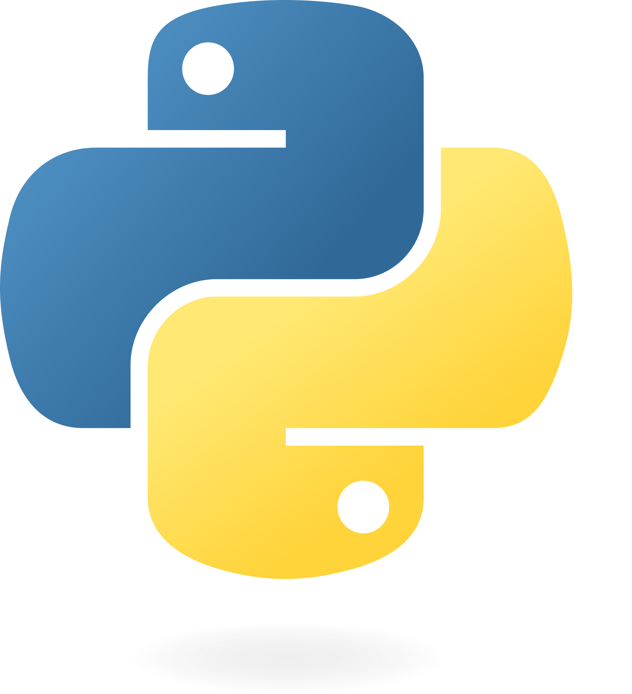

# 👋 Hi, this is Karu chan!  
👨‍💻 Engineer | 🧠 Data Scientist | 🎮 Game Developer Enthusiast | 🔬 Affective Computing | 🏋️‍♀️ Health and Nutrition Enthusiast

## 🔧 Technologies & Tools  

  
  
  
  
  
  

## 📈 GitHub Stats  
  

## 📫 Connect with Me  
  
  
